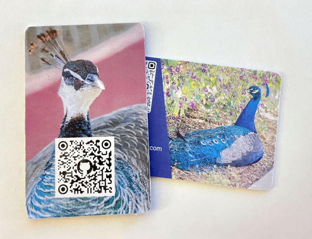

# NFC Business Card

Using this space to document my trials and tests for making my own NFC Business Card without spending money on a professional one.

---

*Sample Business Cards I made for this exercise*

[Testing Tapping](assets/TapDemo.mp4)

---

## Making these, TL;DR:

* Look for **NTAG215** NFC cards on shopping site
* Use **NFC Tools** on App Store ([iOS](https://apps.apple.com/us/app/nfc-tools/id1252962749)/[Android](https://play.google.com/store/apps/details?id=com.wakdev.wdnfc&hl=en_US&gl=US)) to write a [linktree](https://www.linktree.com)/other URL to it
* Use a QR code generator (eg. [QRCode Monkey](https://www.qrcode-monkey.com/)) to make a URL or contact QR code.
* Print a label (or buy inkjet printable cards + tray for compatible printer) with the info/QR code and attach
* Profit!

[Photoshop PSD template](assets/tested_layout.psd)
[Photoshop PSD template v2](assets/tested_layout_v2.psd)

---

## Overview

For a lot of us, getting normal business cards just ends up as trashcan waste in short order.  While they're useful for getting contact information, they also lose their utility once you have that information dumped into a contact book or notepad.  Really, their value is in the information on the card, not the card itself.  Confronted with this, people will usually just take a picture of the card with their smartphone.  After all, the smartphone is the modern contact book.

Knowing that the target is the smartphone, the process of getting information in can be made easier.  The first and more obvious is a [QR code](https://en.wikipedia.org/wiki/QR_code). QR codes allow embedding of small quantities of information into an image.  When printed, anyone with a modern smartphone with camera can usually read the QR code and follow the information.  Such information can include a URL pointing to a website, or more complex data such as a [MeCard](https://en.wikipedia.org/wiki/MeCard_%28QR_code%29) or [vCard](https://en.wikipedia.org/wiki/VCard).

The other alternative is using [NFC technology](https://en.wikipedia.org/wiki/Near-field_communication).  NFC tags and cards can store small bits of information.  When presented to a phone with recent versions of iOS or Android, the phones can read the information and use it.  In particular, URLs and other URIs (`http://`/`https://`/`mailto:`/`tel:`/etc.) can be quickly read and presented on such phones without any additional apps.  Many phones include NFC readers to allow use of payment cards such as transit cards or [Apple Pay](https://www.apple.com/apple-pay/)/[Google Pay](https://pay.google.com).

Combining these two technologies together into a card means a contact card can now have all the information someone really needs for a business card, without actually requiring someone to give a business card.  

A number of companies have risen up to fill in this gap, knowing this information.  [Popl](https://popl.co/) and [Mobilo](https://www.mobilocard.com/) are just a couple of examples. However, these companies are targeted at the corporate/business space, and their products are priced accordingly.  Most of the rest of us just want to share our social media contact information or our emails, but don't really want to pay for a full priced pro solution.

Thankfully, as it turns out, at small scales, making a card that can do this is actually fairly doable without much in the way of equipment.

## Why?

These cards have a few benefits:

* **They're re-usable**, as you don't actually have to give anyone the card. Just show a QR code or tap on a normal smartphone equipped with NFC, and the information is shared.
  * Corollary: **You really only need one**. After all, if you don't give it away, you just keep it on you.
* So long as you have a smartphone with NFC capability, these are **easy to program with a free app**.
* **Using a QR code in combination with the NFC tag means that you can have people without NFC on their phones get the information**. Alternatively, you can use it to store other data.
* **Doing it yourself is cheaper than buying commercially**. It might not be as high quality as the professional cards, but you can make multiples of these for what a professional company often charges for one.

## Why Not?

These cards do also have some disadvantages.

* In situations where you do legitimately need to give away cards, **these cards are always going to be much more expensive to give away**.  For those cases, it's usually still better to go with a professional printer for some real business cards.
* **Time consuming and a bit homemade looking**.  If you need them to be absolutely professional looking, especially if price is not a concern, I'd recommend going with a proper professional card.  Again, these will cost much more money, often about \$10-\$30/card, but in professional cases, that cost may be justified.  Alternatively, it's possible to make a nicer looking card with an inkjet printer if it supports the inkjet printable cards, but that adds costs if you don't have one, plus you'll have the costs of buying the tray to hold the cards.  For larger quantities of cards, making them one by one, as is necessary with this strategy, will take lots of time.  However, the idea with these cards is that you shouldn't need more than maybe one or two.
* **Bulky**. These are pretty thick cards.  The ones we use for this example are about 0.8mm. This would be the equivalent of 31pt card stock, about double the thickness of a normal business card. Again, the idea however is that you shouldn't need multiples of these.
* **A bit frail with the NFC**.  Anyone who has used hotel key cards know that they occasionally just fail, especially when kept in a wallet.  Thankfully, these cards are quickly reprogrammable. The upside also is that with a QR code on front, you effectively have a backup of the data.
* **Security**.  While the idea of a contact card is that you shouldn't need to absolutely protect the information on it, the nature of an NFC card is that it can be read from (*and if not protected, written to!*) a short distance blind.  This means the information that you should put on the card should be information that you have no problem being shared, even to a party you don't know. Also, you should ***lock the card to prevent tampering.***

## The concept.

The cards to use are known as **NTAG215** NFC PVC cards.  These cards are often used for copying/sharing Amiibos, and can often be found using some combination of "amiibo" and "NFC" on your favorite shopping websites.  They come in multiple forms, including small rounds and bigger hotel key sized cards. These bigger cards have a size very similar to a business card, so these are the cards we'll use.  Dimensionally, the ones I'm using are **85.5mm x 54mm x 0.8mm**, or about **3.37" x 2.13" x 0.03"**.

Price-wise, the cards are relatively affordable.  Non-printable ones can be obtained in smaller 25-packs for around $15 with fast shipping from US sellers.  They're also cheaply available from whichever Chinese marketplace you choose.  Basically, expect to pay around **30-60 cents US/card**, as of the writing of this document in mid-2022.

Importantly, these cards are easily programmed using apps on either iOS or Android.  Specifically, the app "NFC Tools" can be found in the [iOS App Store](https://apps.apple.com/us/app/nfc-tools/id1252962749) or the [Google Play Store](https://play.google.com/store/apps/details?id=com.wakdev.wdnfc&hl=en_US&gl=US) can read and write these cards.  They can also be rewritten as desired.  You can also lock the card to prevent future writes, such as a malicious actor rewriting the data on your card to put a bad link. Alternatively, you can password protect the card, so that rewriting it requires unlocking it with a password first.

The data that can be written to these cards are limited, around 492 bytes. While the data can be any text, similar to a QR code's data, iOS/Android devices usually only accept having a simple URL/URI as the data without requiring a special app to see the data.  Therefore, the data you will want to program to the card will likely be a **http/https web link** to a site with contacts/socials.  The simplest would be something like a [LinkTree](https://linktr.ee/) page for more casual contacts, or perhaps something like a [LinkedIn](https://www.linkedin.com) page for a business card.  Something with more effort might be something like your own URL for a page you control. There are plenty of ways to build a cheap/free website on the web, so that's beyond the scope of this document.

As a backup to the NFC data, it will also make sense to add a QR code to the front of the card that has either identical or otherwise more detailed information.  Generating a QR code is as easy as visiting a website such as [QRCode Monkey](https://www.qrcode-monkey.com/) to generate a QR code for either your URL, or for a `VCARD/MECARD` format contact card, etc.  This can be used in case the card fails, or if you're trying to give your contact information to someone with a smartphone without NFC.

---

## Basic Instructions

### Supplies

For this example, you will need:

* **An NTAG215 NFC card**.  These are buyable on any of a number of shopping sites.  For my example, I went with [these basic bulk blank NFC tags on Amazon](https://www.amazon.com/gp/product/B06ZZWVZ3B).  My 25 pack of tags cost \$14 with free prime shipping, or \$0.56 per card.  For bulk shopping, if you have the time/patience to wait out the shipper, you can get bulk packs on Chinese shopping sites. As an example [this set of 50 NFC cards on AliExpress](https://www.aliexpress.com/item/2251832628174553.html) show as going for a bit over $17 with free shipping for 50 as of the writing of this document, or about \$0.34 per card.  For the results to match what I did, remember to look for cards that are **85.5mm x 54mm**.  These are the cards that are hotel key card sized. There are smaller cards available, as well as small round tags.  These are both programmable as well, but you'll obviously have far less area to use for a QR code or other information.
  * Note that you can also buy these NFC cards as **inkjet printable**.  For those cards, you'll usually need an inkjet printer that can accept a certain NFC card tray and can handle thick media to be able to use them.
* **An NFC capable smartphone**.  Most current and recent iPhones have this built in.  Many Android phones will have this as well.  If you have Apple Pay/Google Pay on your phone, you have an NFC chip.
* **The NFC Tools app**.  [iOS App Store](https://apps.apple.com/us/app/nfc-tools/id1252962749)/[Google Play Store](https://play.google.com/store/apps/details?id=com.wakdev.wdnfc&hl=en_US&gl=US).  While this app has a pro version, the free version is all we're going to need to both program the card, lock/password protect it, and confirm the card works correctly.
* **A website with the information we want to share**.  This can be a [LinkTree](https://linktr.ee/) if you have many links to share. Or a simple social network link such as a [LinkedIn](https://www.linkedin.com) page or [Twitter](https://www.twitter.com) user profile or similar.  Or if you have your own website, even better.
* **For nicer general cards, a set of labels and a printer that can print on them**  The labels should ideally be the same size or larger than the cards, if you want to go edge-to-edge. I used these [adhesive name tag labels on Amazon](https://www.amazon.com/gp/product/B084PZ2BN4) that cost me $7 with free prime shipping to the door.  However, I'd probably recommend getting labels that are a bit bigger, just to make sure you have plenty of bleed space for your design.  (**Update: I've had good luck with these [larger 3 1/2" by 5" labels on Amazon](https://www.amazon.com/gp/product/B08K3MKTKC) as well.  I have an updated template to account.**) These labels had plenty of bleed room on the width side, but the labels were only just long enough to cover the card.  Most companies will provide a website that will include templates for a word processor to print on the labels correctly.
  * Alternative: if you have an **inkjet printer** that is compatible with the inkjet printable cards, a **PVC card tray**. Example: [this tray for certain Canon printers on Amazon](https://www.amazon.com/Inkjet-Card-Tray-Canon-Printers/dp/B00P25H0BA).
* **For labels, Trimming blade.** I used a basic precision knife blade to trim away the label, but you can also use scissors.
* **(Optional) Lamination.**  Since these are meant to be long use cards, it makes sense to try to laminate them. From light testing, it does appear that the NFC tag can be read through basic plastic sheeting, so a lamination should be useful to help preserve the longevity of the card.

### Steps

#### Making the Card Design

1. **Figure out what contact information you're going to want to share, and prepare the information.**
    * For the NFC portion of the card, for simplicity, you want the information to be a single simple URL or URI.  This means either a single website link, or a single email address, a single telephone number, etc.  If you need to share multiple pieces of information, you may want to set up a LinkTree page.  If you want to share multiple basic pieces of contact information, you may want to encode it in the QR code.  More complicated information on the NFC card will otherwise mean your recipients will need to have special apps on their phone, and that just complicates matters.
    * For the QR code portion of the card, you can either choose to keep the same information, or you can put more complicated information. In most cases, iOS and Android phones can read information in somewhat more complex formats without requiring any 3rd party apps.  In particular, contact card information can be stored in a QR code to be saved in a person's contacts.
2. **Generate the QR code you will want to use for the card.**  [QRCode Monkey](https://www.qrcode-monkey.com/) works for an online site to do this. You can also find a number of other sites online.  Alternatively, you can generate a QR code using software such as [Zint](https://zint.org.uk/) or even by using any of a number of QR code generation libraries for various programming languages.
3. Pick your option:
    * **Design and print your label, according to the label maker's instructions.**  Don't forget to include your QR code!  You can probably use a basic business card template to start for this.  Alternatively, get fancy.  Or, if you're lazy, you can go as simple as just printing out the QR code.  For a prototype, we basically just printed a QR code and taped it on the card.  It's not fancy, but it works!
        * For the purposes of this example, I created a [Photoshop template](assets/tested_layout.psd) that contained the dimensions of the card itself, plus the dimensions of the label.  This gave me an idea of how the design would lay out, and where I could fit things in for the bleed to work correctly.  I then exported the image out from Photoshop and into LibreOffice, brought the image in over the template, resized the image to match the settings I had in the original template, and then printed a test sheet to make sure that the design would correctly print over the right place in the labels, as well as fit correctly for the card.
        * ***Update: I found a set of larger 3 1/2" by 5" labels on Amazon that are also reasonably priced, and should give far more bleed room to work with.  I've added a new label layout [Photoshop template V2](assets/tested_layout_v2.psd) that should work nicely with larger labels. Just make sure to size the output image accordingly.***
        * Hint: Most designers for print targets know to let the design bleed a bit to make sure you can get edge to edge printing.
    * **Alternative: for tray based setups with inkjet compatible NFC cards, print on your card using the printer.** Follow the tray maker's instructions for installation, and then print on the card. I definitely recommend doing a few test runs on paper before committing to this.
4. **(For Label Printed Cards) Attach the label from the previous step.** I aligned the label under the card, and then put the label on.  I then cleaned the edges using a precision knife blade, just to keep the edges as clean as possible.

#### Programming the Card

5. **If you have disabled NFC on your phone, enable it.** This varies from phone to phone.
6. **Launch NFC Tools and create the information to write to the card.**
    * Go to **Write**
    * Click **Add a Record**
    * Click either **URL/URI**, or **Custom URL/URI**.  If you're using a web page, the former is easier.
        * Alternatively, click **Social Networks** to add a social network link.
    * Once your record is added, click **Write / nn bytes**
    * Tap the card you're trying to write to on the NFC spot.  I use an iPhone, so for me, that spot is on the upper back of the phone. You should get a confirmation message that the tag was successfully written to.
7. **Sanity check your card**.
    * Check 1:
        * Go back to the home screen of NFC Tools, and click **Read**.
        * Tap the card on the NFC spot.
        * Confirm that the card reads, and that you see the expected record on the page.  Make sure the URL matches what you expect.
    * Check 2:
        * Exit the app and go to your phone's home screen/menu.
        * Tap the card on the NFC spot.
        * You should get a notification informing you to visit your link. Tap through and check your link.
    * Check 3:
        * Scan your QR code using either your phone's camera app, or a QR code specific reader app.
        * Confirm that you can read the QR Code, and that it contains the information you want it to contain.
8. **Password protect and/or lock your NFC card**
    * To Password Protect:
        * **Launch NFC Tools**
        * Click **Other**
        * Click **Set Password**
        * Type in the password to use on the card.
        * Click **OK**.  The screen should ask for the card to be tapped.
        * Tap the card on the NFC spot.
        * You should get a confirmation.
        * To check, use the instructions from the Sanity Check 1, and check that the password protect field is set.
    * To remove the password protection:
        * **Launch NFC Tools**
        * Click **Other**
        * Click **Remove Password**
        * Type in the password used on the card.
        * Click **OK**.  The screen should ask for the card to be tapped.
        * Tap the card on the NFC spot.
        * You should get a confirmation.
        * To check, use the instructions from the Sanity Check 1, and check that the password protect field is not set.
    * To permanently write protect the card:
        * **Launch NFC Tools**
        * Click **Other**
        * Click **Lock Tag**
        * Read the message, and confirm.
        * The screen should ask for the card to be tapped.
        * Tap the card on the NFC spot.
        * You should get a confirmation.

And that's it!

---

## Questions/Suggestions?

* [Open an issue!](https://github.com/jtnishi/NFC-Business-Card/issues/new)
